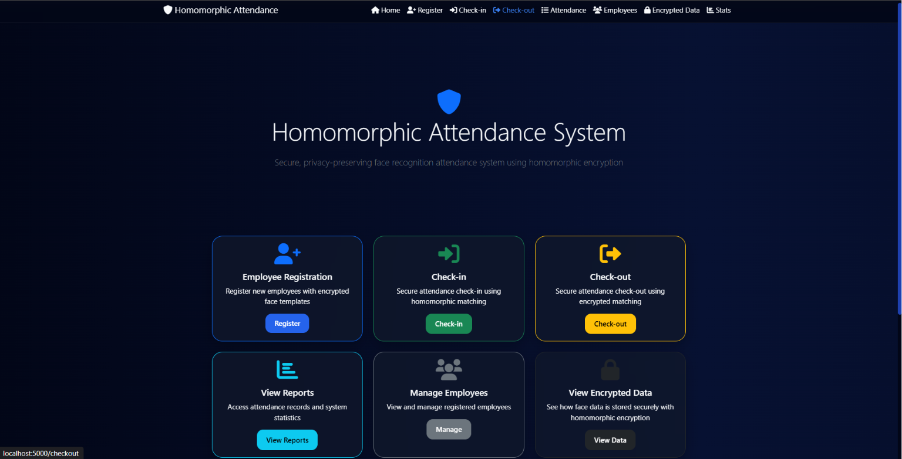
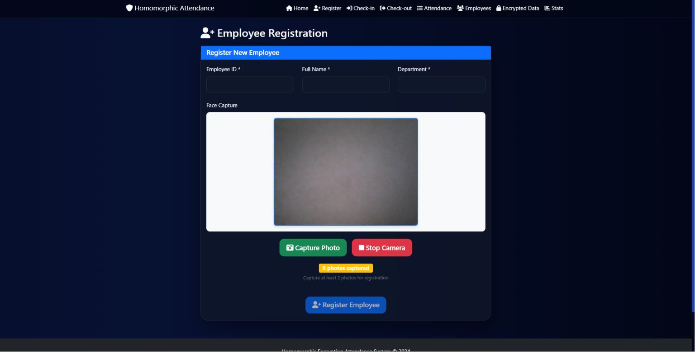
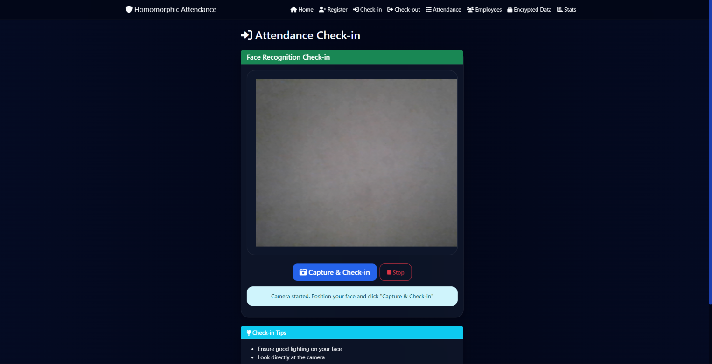
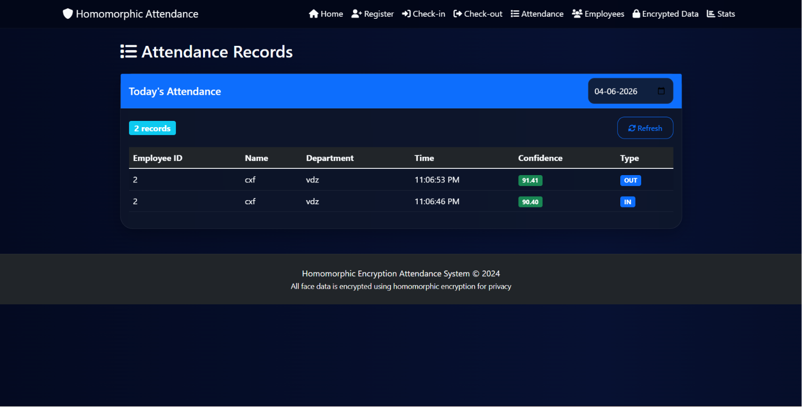
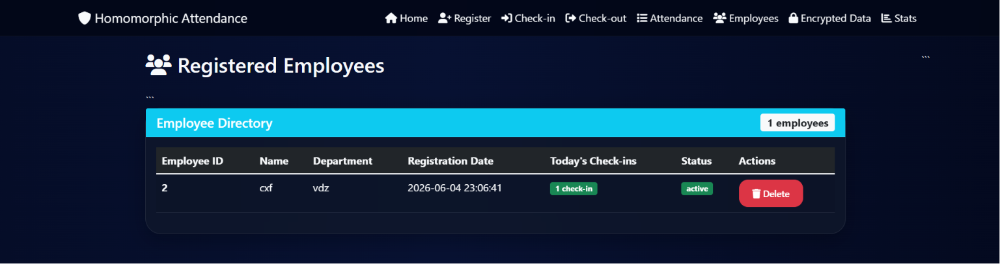
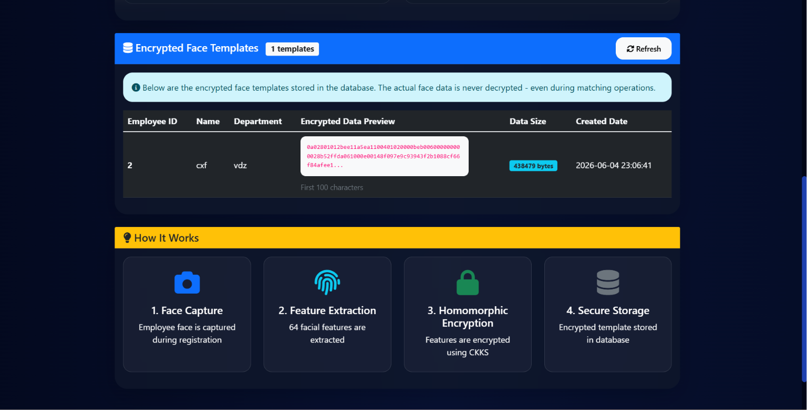
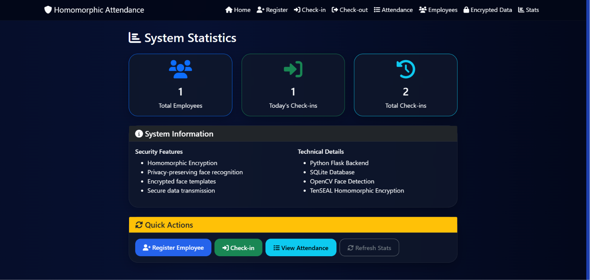

# Homomorphic Encryption Based Facial Recognition System

A privacy-focused facial recognition attendance system built using Flask, OpenCV, SQLite, and Homomorphic Encryption.

---

## About The Project

This project was developed to explore how facial recognition can be combined with homomorphic encryption to create a more secure and privacy-preserving attendance system.

Traditional facial recognition systems usually store biometric information in plain form, which can create privacy concerns. In this project, facial feature vectors are encrypted before storage, helping protect sensitive biometric data while still allowing secure face matching operations.

The system supports:

* Employee registration
* Face-based attendance
* Secure encrypted template storage
* Attendance monitoring
* Modern dashboard interface

---

## Features

### Face Recognition Attendance

* Employee face registration
* Secure check-in and check-out
* Real-time face matching
* Confidence score verification

### Privacy & Security

* Homomorphic encryption using CKKS scheme
* Encrypted facial feature storage
* No raw biometric exposure
* Secure matching workflow

### Dashboard & Management

* Employee directory
* Attendance records
* Statistics dashboard
* Encrypted template viewer

### Modern Interface

* Responsive UI
* Dark themed dashboard
* Interactive cards and tables
* Professional cybersecurity-inspired design

---

## Tech Stack

### Frontend

* HTML
* CSS
* JavaScript
* Bootstrap

### Backend

* Python
* Flask

### Database

* SQLite
* SQLAlchemy

### Computer Vision

* OpenCV
* face_recognition

### Encryption

* TenSEAL
* CKKS Homomorphic Encryption

---

## How The System Works

1. Employee face is captured using webcam
2. Facial features are extracted
3. Feature vectors are encrypted
4. Encrypted templates are stored securely
5. Face matching is performed securely
6. Attendance records are updated

---

## Project Structure

```bash
homomorphic-encryption-based-facial-recognition-system/
│
├── static/
├── templates/
├── app.py
├── requirements.txt
├── attendance.db
└── README.md
```

---

## Installation

### Clone Repository

```bash
git clone https://github.com/CHANDRASHEKARPS/homomorphic-encryption-based-facial-recognition-system.git
```

### Move Into Project Folder

```bash
cd homomorphic-encryption-based-facial-recognition-system
```

### Create Virtual Environment

```bash
python -m venv .venv
```

### Activate Virtual Environment

#### Windows

```bash
.venv\Scripts\activate
```

#### Linux / Mac

```bash
source .venv/bin/activate
```

### Install Required Packages

```bash
pip install -r requirements.txt
```

### Run The Application

```bash
python app.py
```

---

## Screenshots

## Screenshots

### Home Page



---

### Employee Registration



---

### Attendance Check-in



---

### Attendance Check-out


---

### Attendance Records



---

### Employee Management



---

### Encrypted Face Templates



---

### System Statistics




---

## Future Improvements

* Cloud deployment
* Admin authentication
* Anti-spoofing detection
* Real-time CCTV integration
* Advanced attendance analytics
* Email reporting system

---

## Developed By

Chandrashekar PS

📧 [chandrashekar.ps.2004@gmail.com](mailto:chandrashekar.ps.2004@gmail.com)

---

## License

This project is intended for educational and research purposes.
